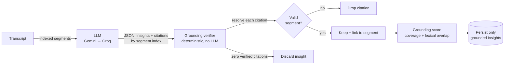
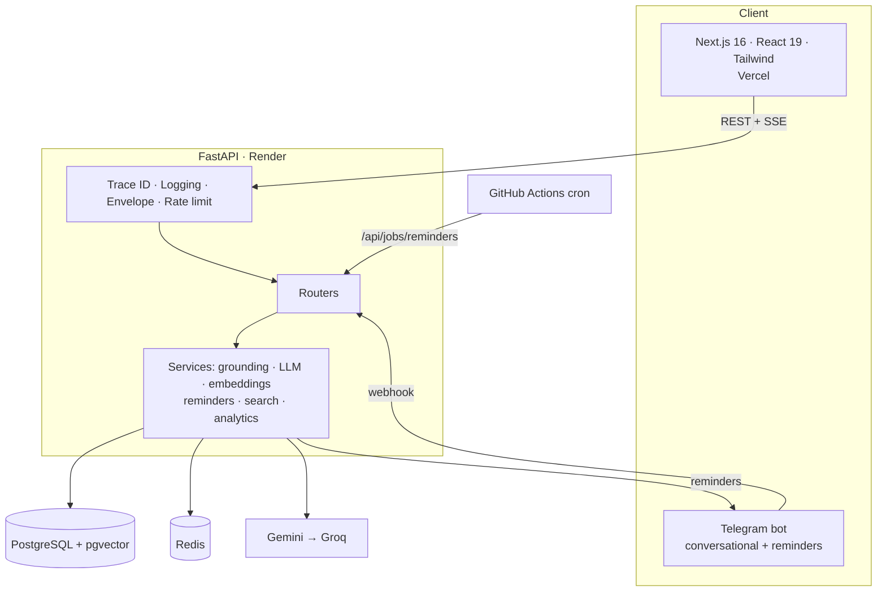

<div align="center">

# 🎙️ Hintro — Meeting Intelligence Service

### Turn meeting transcripts into insights you can trust.

Grounded AI that extracts summaries, decisions, action items, and follow-ups — with a **verifiable citation for every claim** — then tracks ownership, detects overdue work, and nudges people through Telegram & Discord.

<br/>

[](https://hintro-meeting-intelligence.vercel.app)
[](https://hintro-meeting-intelligence-i2zr.onrender.com/api/docs)
[](https://hintro-meeting-intelligence-i2zr.onrender.com/api/evaluation)

<br/>


[](https://github.com/ghostiee-11/hintro-meeting-intelligence/actions/workflows/ci.yml)

<br/>


<sub>Demo login &nbsp;•&nbsp; <code>demo@hintro.ai</code> &nbsp;/&nbsp; <code>demo-password-123</code></sub>

</div>

---

## ✨ Why this stands out

> Most "AI meeting" tools ask the model to cite and hope. Hintro **verifies every citation against the transcript in code** and discards anything unsupported — so hallucinated insights physically cannot reach you.

- 🛡️ **Verifiable citation engine** — each AI claim must resolve to a real transcript segment; unresolved citations are dropped, zero-citation insights are discarded, and every insight gets a **grounding score**.
- 🔁 **Resilient AI layer** — Google **Gemini** primary with an automatic **Groq** fallback, so the live demo keeps working through quota limits and outages.
- 💬 **Conversational Telegram assistant** (Groq) — ask about your meetings, get reminders with **two-way action buttons**, and **log a meeting by pasting a transcript or uploading a file**.
- ⚡ **Live streaming analysis** (SSE) and an **interactive transcript** where clicking a citation scrolls to its exact source line.
- 🔎 **Semantic search** across every meeting via `pgvector`.
- 🏭 **Production-minded** — unified response envelope, trace IDs, structured logging, global error handling, Redis caching + rate limiting, Docker, CI/CD, and tests.

---

## 🔗 Live

| | URL |
|---|---|
| 🖥️ **Web app** | https://hintro-meeting-intelligence.vercel.app |
| ⚙️ **API** | https://hintro-meeting-intelligence-i2zr.onrender.com |
| 📘 **Swagger / OpenAPI** | https://hintro-meeting-intelligence-i2zr.onrender.com/api/docs |
| 🧪 **Evaluation** | https://hintro-meeting-intelligence-i2zr.onrender.com/api/evaluation |
| 🤖 **Telegram bot** | [@hintro_reminders_bot](https://t.me/hintro_reminders_bot) |

---

## 🧠 The grounding guarantee



The model cites **integer segment indices** (hard to fabricate, trivial to verify). A pure, LLM-free verifier then enforces the rule "every insight has at least one citation" **by construction**. Details in [AI_APPROACH.md](./AI_APPROACH.md).

---

## 🏗️ Architecture



```
hintro/
├── backend/            FastAPI (the major codebase)
│   ├── app/
│   │   ├── core/       config · logging · security · errors · envelope · middleware · redis · deps
│   │   ├── db/         async engine + session
│   │   ├── models.py   SQLAlchemy ORM (+ pgvector)
│   │   ├── schemas/    Pydantic v2 (camelCase contract)
│   │   ├── services/   grounding · llm · embeddings · meetings · analysis · reminders · telegram_bot · search · analytics
│   │   └── api/routes/ thin HTTP routers
│   ├── alembic/        migrations
│   └── tests/          pytest (unit + integration)
├── frontend/           Next.js premium dashboard
├── .github/workflows/  ci.yml · reminders.yml (cron)
├── docker-compose.yml  · render.yaml
```

---

## 🚀 Quickstart

### Docker (one command for infra)
```bash
git clone https://github.com/ghostiee-11/hintro-meeting-intelligence.git
cd hintro-meeting-intelligence
cp backend/.env.example backend/.env     # add GEMINI_API_KEY / GROQ_API_KEY
docker compose up -d db redis            # Postgres (pgvector) :5433, Redis :6379
docker compose up --build api            # API on http://localhost:8000
docker compose exec api uv run python -m scripts.seed
```

### Manual
```bash
# Backend (Python 3.12 + uv)
cd backend
uv sync --extra dev
uv run alembic upgrade head
uv run python -m scripts.seed
uv run uvicorn app.main:app --reload --port 8000

# Frontend (Node 22 + pnpm)
cd frontend
cp .env.example .env.local               # NEXT_PUBLIC_API_URL=http://localhost:8000
pnpm install && pnpm dev                  # http://localhost:3000
```

Sample transcripts to upload live in [`frontend/public/samples/`](./frontend/public/samples).

---

## 🧰 Tech stack

| Layer | Choice |
|---|---|
| **Backend** | FastAPI · SQLAlchemy 2.0 (async) · Alembic · Pydantic v2 · uv |
| **Frontend** | Next.js 16 (App Router) · React 19 · TypeScript · Tailwind v4 · Framer Motion · Recharts |
| **Data** | PostgreSQL 16 + `pgvector` · Redis |
| **AI** | Google Gemini (primary) → Groq (fallback) · deterministic grounding verifier · Gemini embeddings |
| **Integrations** | Telegram Bot API (two-way + conversational) · Discord webhook |
| **Infra** | Docker · GitHub Actions (CI + cron) · Render (API + DB + Redis) · Vercel (web) |

---

## 📡 API at a glance

All business endpoints return a unified envelope: `{ "traceId", "success", "data" | "error" }`.

| Method | Endpoint | Purpose |
|---|---|---|
| `POST` | `/api/auth/register` · `/api/auth/login` | JWT auth |
| `POST` `GET` | `/api/meetings` | create / list (pagination + filter) |
| `GET` | `/api/meetings/:id` | meeting with transcript, insights, citations |
| `POST` | `/api/meetings/:id/analyze` | grounded analysis (+ `/analyze/stream` SSE) |
| `POST` `GET` `PATCH` | `/api/action-items` ... `/:id/status` | manage + filter |
| `GET` | `/api/action-items/overdue` | overdue detection |
| `POST` | `/api/jobs/reminders` | scheduled reminder job (cron-secret protected) |
| `GET` | `/api/search?q=` · `/api/analytics` | semantic search · dashboard analytics |
| `GET` | `/health` · `/api/evaluation` | system |

<details>
<summary><b>curl example</b></summary>

```bash
BASE=https://hintro-meeting-intelligence-i2zr.onrender.com
TOKEN=$(curl -s -X POST $BASE/api/auth/login -H 'Content-Type: application/json' \
  -d '{"email":"demo@hintro.ai","password":"demo-password-123"}' \
  | python3 -c "import sys,json;print(json.load(sys.stdin)['data']['token'])")

curl -s "$BASE/api/meetings?limit=5" -H "Authorization: Bearer $TOKEN"
curl -s "$BASE/api/search?q=which+database+did+we+choose" -H "Authorization: Bearer $TOKEN"
```
</details>

---

## 🤖 Telegram assistant

The bot ([@hintro_reminders_bot](https://t.me/hintro_reminders_bot)) is powered by Groq and is genuinely useful:

- **Chat** — "what's overdue?", "summarize the last meeting", "what did we decide about the launch?" (answers grounded in your data).
- **Log a meeting** — paste a transcript or upload a `.txt` / `.vtt` / `.srt` file; it creates and analyzes the meeting and replies with the results.
- **Two-way reminders** — overdue items arrive with **Mark In Progress / Mark Complete** buttons that update the item from chat.
- **Commands** — `/help` · `/meetings` · `/overdue`

---

## ✅ Quality & ops

- **Tests:** `cd backend && uv run pytest -q` — 21 unit + integration tests (grounding engine, validation, overdue, full auth→meeting→action-item flow).
- **Lint:** `uv run ruff check app`
- **CI:** GitHub Actions runs lint + migrations + tests + frontend build on every push.
- **Cron:** GitHub Actions calls the protected reminder job every 15 min (24h dedupe).

---

## 📚 Documentation

| Doc | What's inside |
|---|---|
| [DECISIONS.md](./DECISIONS.md) | Tech choices, alternatives, trade-offs |
| [AI_APPROACH.md](./AI_APPROACH.md) | Prompt design, citation strategy, hallucination prevention, limitations |
| [TESTING.md](./TESTING.md) | Scenarios, edge cases, limitations |
| [CHANGELOG.md](./CHANGELOG.md) | Implementation milestones |
| [CHECKLIST.md](./CHECKLIST.md) | Submission checklist |

<div align="center"><sub>Built for the Hintro Backend / Fullstack Engineering Internship assignment.</sub></div>
